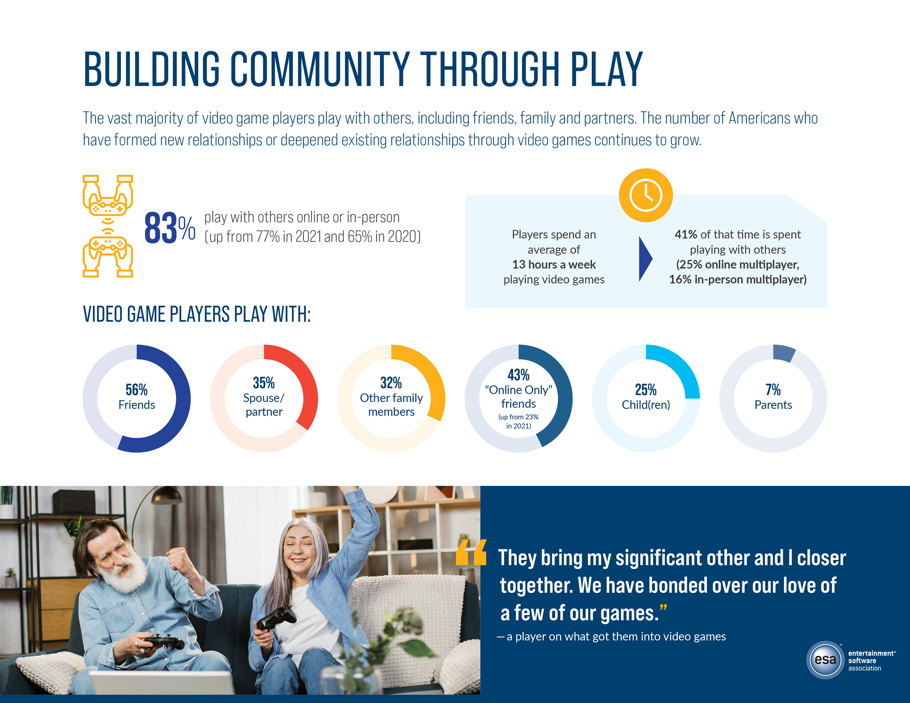

# 1.2 Stakeholders

## Customer Role

An important stakeholder in a video game is obviously the customers, since they will purchase and likely play the game. When analysing what a gamer would want out of a game, it is important to know who the average gamer is.

<figure><figcaption>
Distribution of the Average Age of a US Gamer.
</figcaption></figure>

This graph shows that the age of gamers are predominantly from under 18 to 34. This shows that a game should probably aim to be modern in it's design as to appeal to this age group

## Demographics
