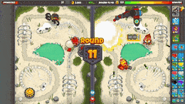
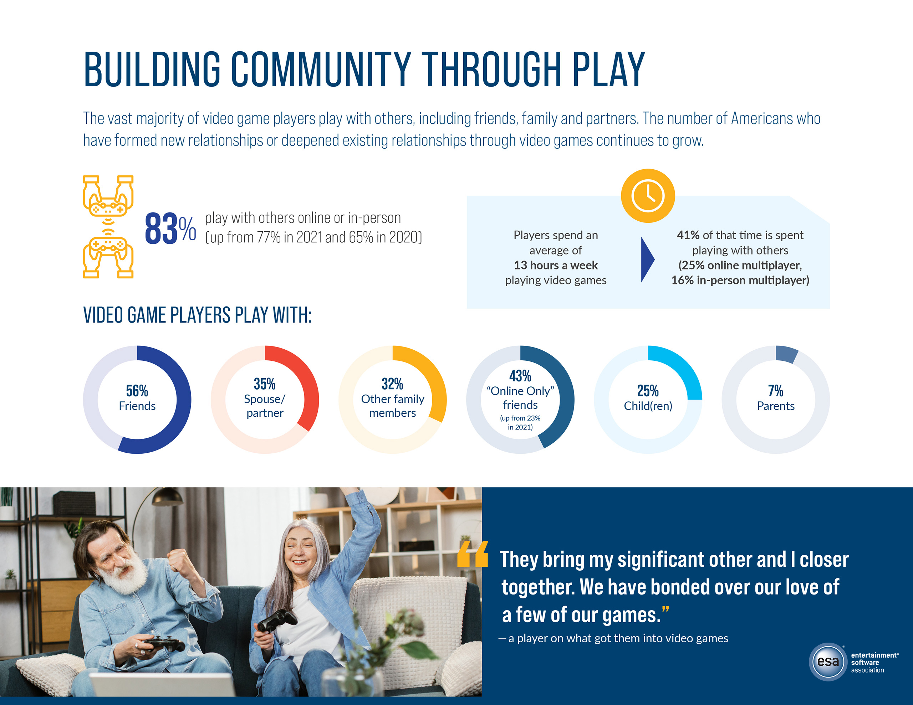

# 1.3 Research

## Bloons TD Battles 2

<figure><figcaption>
Gameplay from Bloons TD Battles 2
</figcaption></figure>

### Overview

In this game, you control one side of the screen in an online tower defense game and have to place and then upgrade different types of monkeys to defend against oncoming "bloons". The aim is to not let the bloons go all the way round various different maps, as that would mean you lose life. Some of these bloons come automatically for each player at the start of each round, however some can come from your opponent from the other side of the screen when they pay for them. In return for sending more bloons at your opponent, you can try and get your opponent to lose life, but you can also increase the amount of money you make each cycle. The winner is then the person who doesn't lose all of their life, or if the game goes all 40 rounds, the player with the most life. The game is rated PEGI 3.

### Controls

The game uses the mouse for most of the game, such as to move monkeys to the position where they can be located to send in bloons and to buy upgrades. However there are shortcuts for the keyboard that can make managing the game easier. The game does not have controller support, which my game also won't have. The game requires the user to use the left mouse button to move and place monkeys, and also to send bloons at the opponent.  &#x20;

<figure><figcaption>
The Left Mouse Button
</figcaption></figure>

### Features



| Feature                        | Justification                                                                                                                                       |
| ------------------------------ | --------------------------------------------------------------------------------------------------------------------------------------------------- |
| Multiplayer                    | My game focuses on having two players, and so would have to be multiplayer.                                                                         |
| Controls                       | Use simple controls that use the keyboard and doesnt have controller support.                                                                       |
| Easily accessible interface    | The interface should be clear for users so that they know what different abilities do. These can either be outlined through images or through text. |
| Interaction with your opponent | The game focuses on interactivity between opponents, so they need to be able to influence each other's gameplay.                                    |



| Feature                 | Justification                                                                                                                                                    |
| ----------------------- | ---------------------------------------------------------------------------------------------------------------------------------------------------------------- |
| Lives system            | The game wouldn't have a lives system as it is puzzles without a time limit or any restrictions on them.                                                         |
| Different Characters    | My game will not utilize different characters, as there will only be one character.                                                                              |
| Tower Defense           | The game wouldn't be a tower defense game, it would be a puzzle game and so the tower defense element isn't a good fit. This includes the bloons not being used. |
| Multiple different maps | My game will have puzzles occur once, and so there is no need for multiple different maps.                                                                       |
| Money                   | My game doesn't need to have currency or have a way for them to gain money, and so it won't be included.                                                         |



## Fireboy and Watergirl

<figure><figcaption>
Fireboy and Watergirl Gameplay
</figcaption></figure>

### Overview

Fireboy and Watergirl is a flash game series where two players can play together locally as two characters, Fireboy and Watergirl, to beat various levels together. The game is a platformer where there are puzzle elements, as there are aspects where only one of the characters can go, and the players aim to capture all gems on the map and to make it the whole through eaqch level. The game works with a level system, with many different and unique levels with different puzzles for the users. The game is PEGI 3.

### Controls

The game uses WASD and the arrow keys on keyboard to allow the characters to move for the different characters on the browser version of the game.

<figure><figcaption>
The WASD Controls
</figcaption></figure>

### Features



| Feature        | Justification                                                                                                                                                 |
| -------------- | ------------------------------------------------------------------------------------------------------------------------------------------------------------- |
| Controls       | The game uses the keyboard WASD or arrow key control, and as my game is intended for use on a computer, this is what I should use.                            |
| Multiplayer    | My game also requires there being more than one player at a time, and so I will include the multiplayer element.                                              |
| World building | The game features various levels, and through aspects such as the puzzles and the background, there is an element of worldbuilding I want to incorporate.     |
| Puzzles        | The game features puzzles that challenge the user and make them think about how to get past certain obstacles, which is what I want my game to be focused on. |



| Feature      | Justification                                                                                                                     |
| ------------ | --------------------------------------------------------------------------------------------------------------------------------- |
| Levels       | My game will not feature levels as it is about competing between two players, and so levels will not be necessary.                |
| Cooperative  | My game focuses on two players playing individually and against each other, and so cooperative would go against what my game is.  |
| Gems         | My game is focused on completing puzzles and racing an opponent, and so adding a extra element such as gems wouldn't be needed.   |
| Platformer   | My game is a puzzle game, and so the game will not be a platformer.                                                               |



## Just Act Natural

<figure><figcaption>
Just Act Natural Gameplay
</figcaption></figure>

### Overview

Just Act Natural is a party game where multiple online players play together in various minigames to try and win points. The games have players competing against each other while hiding among various AI characters, aiming to complete different objectives depending on which minigame it is. The game works by having a group be set up by a player, who can then share the code with their friends to have people join. The game finishes when a winner has been found after reaching a set number of points, which can be changed by the group leader along with many of the settings.

### Controls

The game uses the keyboard to allow the character to move, with WASD but it also uses the mouse to allow the character to look around. For some situations in the game, the user may have to perform actions such as shooting a gun, which would require pressing the left mouse button.

### Features



| Feature  | Justification |
| -------- | ------------- |
|          |               |
|          |               |
|          |               |



| Feature  | Justification |
| -------- | ------------- |
|          |               |
|          |               |
|          |               |


